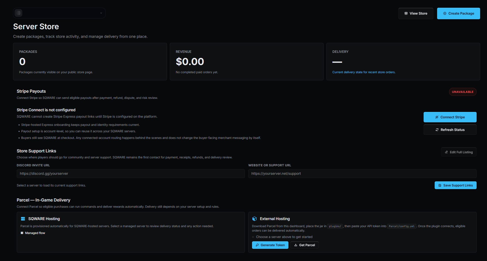

# Parcel

[](https://github.com/sqware-gg/Parcel/actions/workflows/build.yml)

Parcel is the Minecraft webstore delivery plugin for servers using SQWARE commerce. It polls the SQWARE delivery API, runs paid package commands from the server console, queues online-only deliveries, and confirms successful delivery back to your store.

Use it when you need reliable Minecraft donation store deliveries, rank purchases, crate key commands, currency packages, or other paid server rewards without exposing inbound ports on your Minecraft server.

Server owners list their server on `sqware.gg`, configure packages from the SQWARE dashboard store page, and connect Stripe Connect to receive payouts.



## Links

- Website: https://sqware.gg
- Support and plugin updates: https://discord.sqware.gg

## Compatibility

- Server software: Bukkit, Spigot, or Paper
- API target: Spigot `1.8.8`
- Runtime: Java `8+`
- Build runtime: Java `9+` for Maven `--release` support
- Build tool: Maven

Parcel is designed for broad server compatibility, including older production networks.

## Why Server Owners Use It

- Sell ranks, keys, currency, cosmetics, or other server packages from a hosted store page.
- Deliver webstore purchases with console commands.
- Receive payouts through Stripe Connect after commerce is configured.
- Keep the Minecraft server outbound-only; no port forwarding or embedded web server.
- Queue packages until the player joins when needed.
- Avoid duplicate delivery with order idempotency.
- Retry confirmations after temporary network or API issues.
- Keep delivery state on disk so restarts are safe.

## Features

- Outbound-only connection to `https://sqware.gg`.
- Bearer token authentication from `plugins/Parcel/config.yml`.
- Automatic heartbeat with server software, version, player count, and delivery state.
- Delivery polling every 15 seconds.
- Console command execution through `Bukkit.dispatchCommand`.
- Durable queueing for deliveries that require the player to be online.
- `{player}` and `{uuid}` placeholder replacement.
- Idempotency checks to avoid duplicate command execution.
- Local confirmation retry storage when the delivery API cannot be reached.

## SQWARE Store Setup

Before installing Parcel on your Minecraft server:

1. List your Minecraft server at https://sqware.gg.
2. Open the SQWARE dashboard store page at https://sqware.gg/dashboard-store.
3. Configure your store details, packages, prices, and delivery commands.
4. Connect Stripe Connect from the dashboard so your store can receive payouts.
5. Create or copy the Parcel API token for your server.
6. Install Parcel on the Minecraft server and paste that token into `plugins/Parcel/config.yml`.

Delivery commands are configured in the dashboard and executed by the Minecraft server console when Parcel receives a paid order.

## Installation

1. Download the latest jar from the GitHub Releases page.
2. Stop your Minecraft server.
3. Put the jar in the server `plugins` folder.
4. Start the server once to generate `plugins/Parcel/config.yml`.
5. Copy your Parcel API token from the SQWARE dashboard store page.
6. Paste it into `api-token`.
7. Run `/parcel reload` or restart the server.

Keep the API token private. Anyone with that token may be able to access delivery functions for your store.

## Configuration

```yaml
api-token: ""
debug: false
join-delivery-delay-seconds: 2
```

- `api-token`: token from the SQWARE dashboard store page.
- `debug`: logs extra delivery details to the console.
- `join-delivery-delay-seconds`: delay before queued online-only deliveries run after a player joins.

The API host is intentionally fixed so deliveries always use the SQWARE delivery endpoint.

## Commands

```text
/parcel status
/parcel reload
/parcel poll
```

## Permissions

```text
parcel.admin  - use Parcel status, reload, and poll commands, default op
```

## Delivery Safety

Parcel treats the order ID as an idempotency key. If the same order is seen more than once, commands are not re-run after the delivery has already been processed.

If commands execute but the delivery API cannot be reached for confirmation, Parcel saves the confirmation locally and retries. This prevents paid deliveries from becoming uncertain during temporary network or API problems.

Local state files:

```text
plugins/Parcel/queued-deliveries.json
plugins/Parcel/pending-confirmations.json
```

Do not delete these files unless you understand the delivery state they contain.

## Privacy

Parcel sends only the data needed to poll and confirm deliveries, such as plugin version, server software/version, player count, and delivery state. It does not send server logs, files, MOTD, bind address, or player chat.

## Updating

Stop the server, replace the jar, and start the server again. Keep `plugins/Parcel/config.yml` and the local delivery state files.

Release history is tracked in [CHANGELOG.md](CHANGELOG.md).

## Build From Source

```powershell
mvn package
```

The shaded server jar is written to:

```text
target/parcel.jar
```

## Troubleshooting

- `API token is not set`: add the token to `plugins/Parcel/config.yml`, then run `/parcel reload`.
- `API token is not allowed to use Parcel`: regenerate or reissue the token from the SQWARE dashboard store page.
- Delivery API route unavailable: the server reached the service endpoint, but the API route was not available. Check service status or ask support.
- Deliveries wait forever: confirm the player name or UUID in the order and check online-only package settings.
- Commands fail: test the exact command in console and verify placeholders are valid for your package.

## License

Parcel is licensed under the Apache License, Version 2.0. See [LICENSE](LICENSE) and [NOTICE](NOTICE).

This license applies to the Parcel plugin source in this repository. SQWARE hosted services, dashboard, APIs, trademarks, and commercial terms are separate from this repository.

## Support

For setup help, compatibility questions, and plugin updates, use https://discord.sqware.gg.
